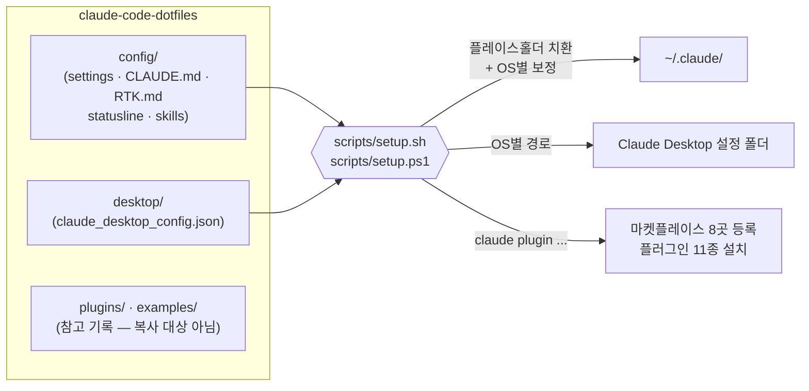

# claude-code-dotfiles


개인 Claude Code 사용 환경의 공개 백업 저장소입니다.
새 머신에서 환경을 복원하거나, 같은 구성을 참고하려는 다른 사용자가 그대로 활용할 수 있습니다.

> 개인 식별 정보(사용자명·계정 ID·개인 경로·API 식별자)는 모두 `YOUR_USERNAME`, `YOUR_OC_ID` 등의 플레이스홀더로 치환되어 있습니다. → [비식별화 정책](#비식별화-정책)

## 목차

- [동작 방식](#동작-방식)
- [OS 지원 매트릭스](#os-지원-매트릭스)
- [빠른 시작](#빠른-시작)
- [파일 구조](#파일-구조)
- [RTK — 토큰 절약 레이어](#rtk--토큰-절약-레이어)
- [구성 요소 상세](#구성-요소-상세) (플러그인 · 스킬 · MCP · Statusline · 설정값)
- [수동 설치](#수동-설치)
- [설치 후 체크리스트](#설치-후-체크리스트)
- [비식별화 정책](#비식별화-정책)

---

## 동작 방식



규칙은 세 가지입니다.

| 디렉토리 | 의미 |
|---|---|
| **`config/`** | `~/.claude/` 로 들어가는 것 전부 (= `~/.claude/` 미러) |
| **`desktop/`** | Claude Desktop 앱 설정 (OS별 경로가 다름) |
| **`plugins/` `examples/`** | 참고 기록 — 직접 복사하지 않고 setup 스크립트·문서가 참조 |

---

## OS 지원 매트릭스

| 구성 요소 | Windows | macOS | Linux | WSL |
|---|---|---|---|---|
| 실행 스크립트 | `setup.ps1` 또는 Git Bash로 `setup.sh` | `setup.sh` | `setup.sh` | `setup.sh` |
| `config/` → `~/.claude/` | ✅ | ✅ | ✅ | ✅ |
| `settings.json` 자동 보정 | 사용자명 치환 | 사용자명 치환 + statusline 경로 `$HOME` 보정 + Windows 전용 env 제거 | ← 동일 | ← 동일 |
| Claude Desktop 설정 | `%APPDATA%\Claude\` | `~/Library/Application Support/Claude/` | `~/.config/Claude/` | ⚠ 호스트 Windows에서 별도 적용 |
| statusline 스크립트 | Git Bash 필요 | 기본 bash | 기본 bash | 기본 bash |
| [rtk](#rtk--토큰-절약-레이어) | 사실상 필수 | 사실상 필수 | 사실상 필수 | 사실상 필수 |

---

## 빠른 시작

### 1. 전제 조건

**Claude Code CLI** — Native Install 권장 (npm 방식은 더 이상 권장하지 않음)

| 플랫폼 | 명령 |
|---|---|
| Windows PowerShell | `irm https://claude.ai/install.ps1 \| iex` |
| Windows CMD | `curl -fsSL https://claude.ai/install.cmd -o install.cmd && install.cmd && del install.cmd` |
| macOS / Linux / WSL | `curl -fsSL https://claude.ai/install.sh \| bash` |
| WinGet (Windows 대안) | `winget install Anthropic.ClaudeCode` |
| Homebrew (macOS 대안) | `brew install --cask claude-code` |

설치 확인: `claude --version` / `claude doctor`

**rtk** (사실상 필수) — `settings.json` 의 PreToolUse 훅이 `rtk` 를 호출하므로, **rtk 미설치 상태로 settings.json 을 적용하면 모든 Bash·PowerShell 도구 호출에서 훅 오류가 발생**합니다. setup 스크립트가 설치 여부를 검사하고 경고합니다. → [RTK](#rtk--토큰-절약-레이어)

**Git for Windows** (Windows만) — Bash 도구와 statusline 스크립트가 사용.

**Node.js v20+** (옵션) — `@playwright/mcp`, `korean-law-mcp` 등 npx 기반 MCP 서버 사용 시에만 필요.

### 2. OS별 설치

<details>
<summary><b>🪟 Windows (PowerShell)</b></summary>

```powershell
git clone https://github.com/jelitz/claude-code-dotfiles.git
cd claude-code-dotfiles
.\scripts\setup.ps1
```

- `YOUR_USERNAME` → 실제 사용자명 자동 치환
- Claude Desktop 설정은 `%APPDATA%\Claude\` 에 복사
- `CLAUDE_CODE_GIT_BASH_PATH` 가 실제 Git Bash 경로와 일치하는지 마지막에 확인

</details>

<details>
<summary><b>🍎 macOS / 🐧 Linux</b></summary>

```bash
git clone https://github.com/jelitz/claude-code-dotfiles.git
cd claude-code-dotfiles
bash scripts/setup.sh
```

스크립트가 OS를 감지해 자동으로:
- statusline 경로를 `$HOME` 기준으로 보정
- Windows 전용 env (`CLAUDE_CODE_GIT_BASH_PATH`) 제거
- Claude Desktop 설정을 macOS는 `~/Library/Application Support/Claude/`, Linux는 `~/.config/Claude/` 에 복사

</details>

<details>
<summary><b>🐧 WSL</b></summary>

```bash
git clone https://github.com/jelitz/claude-code-dotfiles.git
cd claude-code-dotfiles
bash scripts/setup.sh
```

- `~/.claude/` 설정은 WSL 내부에 적용 (Linux와 동일하게 보정)
- **Claude Desktop 은 Windows 호스트에서 실행**되므로, Desktop 설정은 호스트 PowerShell에서 `scripts\setup.ps1` 을 실행하거나 `desktop/claude_desktop_config.json` 을 `%APPDATA%\Claude\` 에 직접 복사

</details>

setup 스크립트가 수행하는 일 (6단계):

1. `config/` 의 설정 파일 5종 → `~/.claude/` 복사 (플레이스홀더 치환 + OS 보정)
2. `config/skills/` 의 사용자 스킬 3종 → `~/.claude/skills/`
3. `desktop/claude_desktop_config.json` → OS별 Claude Desktop 경로
4. 커스텀 마켓플레이스 8곳 등록
5. 활성 플러그인 11종 설치
6. rtk 설치 여부 검사 및 경고

---

## 파일 구조

```
claude-code-dotfiles/
├── config/                              # ~/.claude/ 미러
│   ├── settings.json                    #   메인 설정 (hooks·플러그인·권한 정책)
│   ├── settings.local.json.template     #   머신별 로컬 설정 템플릿
│   ├── CLAUDE.md                        #   전역 AI 지시사항 (@RTK.md import)
│   ├── RTK.md                           #   rtk 메타 명령 사용 지침
│   ├── statusline-bash.sh               #   커스텀 2줄 statusline
│   └── skills/                          #   사용자 스킬 (Exa 검색 3종)
│       ├── code-search-exa/
│       ├── company-research/
│       └── web-search-advanced-research-paper/
├── desktop/
│   └── claude_desktop_config.json       # Claude Desktop MCP·환경 설정
├── plugins/                             # 참고 기록 (복사 대상 아님)
│   ├── installed_plugins.json           #   플러그인 목록 (활성/비활성/스코프 + 설명)
│   └── known_marketplaces.json          #   마켓플레이스 목록 (실사용/등록만 구분)
├── examples/
│   └── project-permissions.example.json # 프로젝트 종속 권한 예시 (Railway 등)
└── scripts/
    ├── setup.sh                         # 복원 스크립트 (Git Bash/macOS/Linux/WSL)
    └── setup.ps1                        # 복원 스크립트 (Windows PowerShell)
```

---

## RTK — 토큰 절약 레이어

[rtk](https://github.com/rtk-ai/rtk) (Rust Token Killer)는 git/ls/grep 등 자주 쓰는 CLI 출력물을 LLM 컨텍스트에 들어가기 전에 압축·필터링해 **토큰을 60-90% 절약**하는 단일 Rust 바이너리 프록시입니다.

| 구성 요소 | 역할 |
|---|---|
| `config/settings.json` → `hooks.PreToolUse` | `rtk hook claude` — Bash·PowerShell 도구 호출을 가로채 `git status` → `rtk git status` 식으로 자동 재작성 (rtk가 모르는 명령·PowerShell 고유 구문은 그대로 통과) |
| `config/RTK.md` | rtk 메타 명령(`rtk gain`, `rtk discover`, `rtk proxy`) 사용 지침. `CLAUDE.md` 가 `@RTK.md` 로 import |
| 바이너리 위치 | `~/.local/bin/rtk` (PATH 등록 필요, 스냅샷 시점 버전 0.39.0) |

> ⚠ rtk 를 쓰지 않으려면 `~/.claude/settings.json` 에서 `hooks.PreToolUse` 블록을 제거하고, `CLAUDE.md` 의 `@RTK.md` import 줄과 `RTK.md` 를 삭제하면 됩니다.

---

## 구성 요소 상세

<details>
<summary><b>🔌 플러그인 — 활성 11종 / 비활성 8종</b></summary>

### 활성 (`enabled: true`)

| 플러그인 | 마켓플레이스 | 설명 |
|---|---|---|
| `superpowers` | claude-plugins-official | 브레인스토밍·플래닝·TDD·디버깅·코드리뷰 스킬 모음 |
| `context7` | claude-plugins-official | 라이브러리/프레임워크 최신 문서 실시간 조회 (MCP) |
| `pyright-lsp` | claude-plugins-official | Python LSP 지원 (타입 체크·자동완성) |
| `ralph-loop` | claude-plugins-official | Ralph Loop 반복 실행 워크플로 |
| `claude-code-setup` | claude-plugins-official | Claude Code 자동화 추천·설정 헬퍼 |
| `playground` | claude-plugins-official | 단일 HTML playground/explorer 생성 스킬 |
| `codex` | openai-codex | OpenAI Codex 서브에이전트 (rescue, setup). **job은 항상 `--background` 로 실행** (CLAUDE.md 참고) |
| `exa-core` | exa-skills | Exa AI 웹 검색 (search, context, answer, find-similar 등) |
| `document-skills` | anthropic-agent-skills | Anthropic 공식 문서 작업 (PDF·DOCX·XLSX·PPTX·frontend-design 등) |
| `claude-mem` | thedotmack | 세션 간 영속 메모리 (mem-search, timeline-report, smart-explore) |
| `andrej-karpathy-skills` | karpathy-skills | Karpathy 코딩 가이드라인 — 과도한 복잡화 방지·외과적 수정 |

### 설치되어 있지만 비활성 (`enabled: false`)

| 플러그인 | 마켓플레이스 | 비활성 사유 |
|---|---|---|
| `frontend-design` | claude-plugins-official | document-skills의 frontend-design과 중복 |
| `playwright` | claude-plugins-official | claude-in-chrome MCP를 우선 사용 |
| `korean-law` | korean-law-marketplace | 개인 OC ID 필요 (필요시 활성화) |
| `lazyweb` | lazyweb | 옵션 |
| `cloudflare` | claude-plugins-official | Cloudflare 리소스 다룰 때만 활성화 |
| `example-skills` | anthropic-agent-skills | 참고용으로 설치만 해둠 |
| `ui-ux-pro-max` | ui-ux-pro-max-skill | 프로젝트 스코프 설치, 현재 미활성 |
| `sentry` | claude-plugins-official | 특정 프로젝트 스코프로만 설치 (전역 미사용) |

마켓플레이스는 `plugins/known_marketplaces.json` 에 **실사용(active) / 등록만(registered-only)** 으로 구분 기록되어 있습니다. 등록만 해둔 곳(Claudest, ecc, agent-browser, claude-for-financial-services)은 setup 스크립트에서 주석 처리되어 있으며 필요 시 해제하면 됩니다.

</details>

<details>
<summary><b>🧰 사용자 스킬 — Exa 검색 3종</b></summary>

플러그인과 별개로 직접 관리하는 개인 스킬 (`config/skills/` → `~/.claude/skills/`). 셋 다 Exa MCP(`https://mcp.exa.ai/mcp`)를 사용하며, **메인 컨텍스트 오염 방지를 위해 항상 Task agent 로 격리 실행**하도록 작성되어 있습니다.

| 스킬 | 용도 |
|---|---|
| `code-search-exa` | 코드 예제·API 문법·라이브러리 문서 검색 (GitHub/StackOverflow) |
| `company-research` | 기업 정보·경쟁사·시장 리서치 |
| `web-search-advanced-research-paper` | 학술 논문·arXiv 검색 (날짜·텍스트 필터 지원) |

</details>

<details>
<summary><b>🔗 MCP 서버</b></summary>

| 서버 | 등록 방식 | 설명 |
|---|---|---|
| `claude-in-chrome` | Chrome 확장에서 자동 | 브라우저 자동화 기본 수단 (CLAUDE.md 에서 Playwright 보다 우선하도록 지정) |
| `context7` | 플러그인이 자동 등록 | `context7@claude-plugins-official` 활성 시 자동 |
| `claude-mem` (mcp-search) | 플러그인이 자동 등록 | `claude-mem@thedotmack` 활성 시 자동 |
| Slack | claude.ai 커넥터 | claude.ai 계정 연결로 제공 (이 저장소 설정과 무관, 계정에서 별도 연결) |
| `playwright` | Claude Desktop (`desktop/claude_desktop_config.json`) | `npx @playwright/mcp@latest` — Desktop 전용 |
| `korean-law` (옵션) | Claude Desktop | `npx korean-law-mcp@latest --oc YOUR_OC_ID` — 사용 시 `_korean-law-example` 키의 `_` 제거 + 본인 [국가법령정보센터](https://open.law.go.kr) OC ID 입력 |

</details>

<details>
<summary><b>📊 Statusline — 커스텀 2줄 상태 표시</b></summary>

터미널 하단에 세션 정보를 두 줄로 표시합니다 (`config/statusline-bash.sh`).

```
⎇ main │ ◈ Opus 4.8 │ effort: xhigh │ ⚖ advisor: (unset) │ v2.1.165
ctx ████░░░░ 45% │ $0.23 │ 5h ██░░░░░░ 23% ↻ 1h30m │ 7d █░░░░░░░ 13%
```

**Row 1 — identity**

| 항목 | 설명 |
|---|---|
| `⎇ branch` | 현재 git 브랜치 (cyan) |
| `◈ model` | 모델명 (blue, "Claude " 접두어 생략) |
| `effort: <lvl>` | 작업 노력 수준 (magenta) |
| `⚖ advisor: <model>` | `settings.json` 의 `advisorModel` 값 (yellow); 미설정 시 `(unset)` (dim) |
| `v버전` | Claude Code 버전 (dim) |

**Row 2 — usage**

| 항목 | 설명 |
|---|---|
| `ctx bar %` | 컨텍스트 윈도우 사용률 (50%↑ 노랑, 80%↑ 빨강) |
| `$cost` | 세션 누적 비용 ($1↑ 노랑, $5↑ 빨강) |
| `5h bar % ↻ left` | 5시간 rate limit + 리셋까지 남은 시간 |
| `7d bar %` | 7일 rate limit |

**구현 메모**
- advisor 값은 stdin JSON에 없어 스크립트가 `~/.claude/settings.json` 을 직접 읽음 (현재 `advisorModel` 미설정 → `(unset)` 표시)
- 줄 분리는 `printf '%s\n'` 두 번 호출 (Claude Code 다중 줄 statusline 사양)
- 활성화: `settings.json` → `statusLine.command` (Git Bash 식 경로 — setup.sh 가 OS에 맞게 치환)

</details>

<details>
<summary><b>⚙️ 주요 설정값 (settings.json)</b></summary>

| 키 | 값 | 설명 |
|---|---|---|
| `language` | `Korean` | 응답 언어 |
| `effortLevel` | `xhigh` | 기본 작업 노력 수준 (low/medium/high/xhigh/max) |
| `permissions.defaultMode` | `auto` | 안전한 작업은 자동 승인 |
| `hooks.PreToolUse` | `rtk hook claude` | Bash·PowerShell 명령을 rtk 프록시로 재작성 (토큰 절약) |
| `worktree.baseRef` | `fresh` | 워크트리 생성 시 기준 ref |
| `autoDreamEnabled` | `true` | 세션 종료 시 자동 메모리 추출 |
| `teammateMode` | `auto` | Agent Teams 팀원 실행 방식 자동 선택 |
| `skillListingBudgetFraction` | `0.05` | 스킬 목록이 차지하는 컨텍스트 비율 상한 |
| `autoUpdatesChannel` | `latest` | 최신 채널로 자동 업데이트 |
| `remoteControlAtStartup` | `true` | 시작 시 원격 제어 활성화 |
| `inputNeededNotifEnabled` / `agentPushNotifEnabled` | `true` | 입력 필요·에이전트 완료 푸시 알림 |
| `env.CLAUDE_CODE_GIT_BASH_PATH` | Git Bash 경로 | Bash 도구용 (**Windows 전용** — macOS/Linux 설치 시 자동 제거) |
| `env.ENABLE_TOOL_SEARCH` | `true` | 지연 로드 도구 검색 활성화 |
| `env.CLAUDE_CODE_EXPERIMENTAL_AGENT_TEAMS` | `1` | 멀티 에이전트 팀 기능 활성화 |

> `model` 키는 의도적으로 두지 않음 — 세션마다 `/model` 로 선택. `advisorModel` 도 현재 미설정 (`/advisor` 로 필요 시 지정).

### 전역 권한 정책

전역 `settings.json` 의 `permissions.allow` 에는 **범용 권한 2개만** 유지합니다 (브라우저 탭 컨텍스트 조회, Get-FileHash). Railway 배포 운영 등 **프로젝트 종속 권한은 해당 프로젝트의 `.claude/settings.json` 에 두는 것이 원칙**이며, 실제 사용하던 목록은 [`examples/project-permissions.example.json`](examples/project-permissions.example.json) 에 참고용으로 보존되어 있습니다.

</details>

---

## 수동 설치

<details>
<summary>스크립트 없이 직접 설치하기</summary>

```bash
# 1. 설정 파일 복사 (YOUR_USERNAME 치환 필요)
cp config/settings.json ~/.claude/settings.json
cp config/settings.local.json.template ~/.claude/settings.local.json
cp config/CLAUDE.md config/RTK.md ~/.claude/
cp config/statusline-bash.sh ~/.claude/ && chmod +x ~/.claude/statusline-bash.sh
mkdir -p ~/.claude/skills && cp -r config/skills/* ~/.claude/skills/

# macOS/Linux 추가 보정 (statusline 경로 + Windows 전용 env 제거)
#   settings.json 의 "/c/Users/YOUR_USERNAME" → "$HOME" 으로 치환
#   "CLAUDE_CODE_GIT_BASH_PATH" 줄 삭제 (env 블록 첫 항목이라 줄 삭제만으로 JSON 유효)

# 2. Claude Desktop MCP 설정 (OS별 경로)
cp desktop/claude_desktop_config.json "$APPDATA/Claude/claude_desktop_config.json"                      # Windows (Git Bash)
cp desktop/claude_desktop_config.json "$HOME/Library/Application Support/Claude/claude_desktop_config.json"  # macOS
cp desktop/claude_desktop_config.json "$HOME/.config/Claude/claude_desktop_config.json"                 # Linux

# 3. 커스텀 마켓플레이스 등록 (claude-plugins-official 은 기본 등록)
claude plugin marketplace add anthropic-agent-skills github:anthropics/skills
claude plugin marketplace add exa-skills github:benjaminjackson/exa-skills
claude plugin marketplace add openai-codex github:openai/codex-plugin-cc
claude plugin marketplace add thedotmack github:thedotmack/claude-mem
claude plugin marketplace add karpathy-skills github:forrestchang/andrej-karpathy-skills
claude plugin marketplace add korean-law-marketplace github:chrisryugj/korean-law-mcp
claude plugin marketplace add lazyweb https://github.com/aboul3ata/lazyweb-skill.git
claude plugin marketplace add ui-ux-pro-max-skill github:nextlevelbuilder/ui-ux-pro-max-skill

# 4. 플러그인 설치 (활성화 대상)
claude plugin install superpowers@claude-plugins-official
claude plugin install context7@claude-plugins-official
claude plugin install pyright-lsp@claude-plugins-official
claude plugin install ralph-loop@claude-plugins-official
claude plugin install claude-code-setup@claude-plugins-official
claude plugin install playground@claude-plugins-official
claude plugin install codex@openai-codex
claude plugin install exa-core@exa-skills
claude plugin install document-skills@anthropic-agent-skills
claude plugin install claude-mem@thedotmack
claude plugin install andrej-karpathy-skills@karpathy-skills
```

</details>

---

## 설치 후 체크리스트

- [ ] `rtk` 가 PATH에 있는지 확인 (`rtk gain` 실행) — 없으면 [RTK](#rtk--토큰-절약-레이어) 항목 참고
- [ ] (Windows) `settings.json` 의 `CLAUDE_CODE_GIT_BASH_PATH` — Git Bash 실제 경로 확인
- [ ] (macOS/Linux) statusline 경로가 `$HOME` 기준으로 적용되었는지 확인
- [ ] Claude Desktop 의 `localAgentModeTrustedFolders` — 실제 작업 폴더로 변경
- [ ] korean-law MCP 사용 시 본인 OC ID 입력
- [ ] Claude Code 재시작

---

## 비식별화 정책

이 저장소는 공개 백업이므로 다음 원칙을 따릅니다.

| 항목 | 처리 |
|---|---|
| 사용자명이 포함된 경로 | `YOUR_USERNAME` 플레이스홀더 (setup 스크립트가 치환) |
| API·서비스 개인 식별자 (OC ID 등) | `YOUR_OC_ID` 플레이스홀더 + 비활성(`_` 접두) 예시로만 보존 |
| 계정 UUID·디바이스명·기기 상태 캐시 | 백업에서 제거 (앱이 자동 재생성) |
| 사내·개인 NAS 등 비공개 경로 | 백업에서 제거 |
| 자격 증명 (`.credentials.json` 등) | `.gitignore` 로 커밋 차단 |
| 프로젝트 종속 권한 목록 | `examples/` 로 분리, 전역 설정에서 제외 |

갱신 시에도 커밋 전 위 항목이 포함되지 않았는지 확인하세요.

## License

This project is licensed under the MIT License - see the [LICENSE](LICENSE) file for details.
