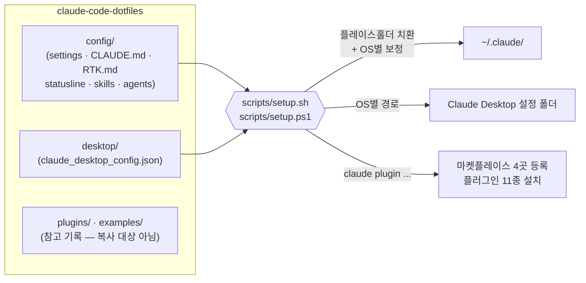

# claude-code-dotfiles


개인 Claude Code 사용 환경의 공개 백업 저장소입니다.
새 머신에서 환경을 복원하거나, 같은 구성을 참고하려는 다른 사용자가 그대로 활용할 수 있습니다.

> 개인 식별 정보(사용자명·계정 ID·개인 경로·API 식별자)는 모두 `YOUR_USERNAME`, `YOUR_OC_ID` 등의 플레이스홀더로 치환되어 있습니다.

## 목차

- [동작 방식](#동작-방식)
- [빠른 시작](#빠른-시작)
- [자세히 보기](#자세히-보기) — 파일 구조 · RTK · pup · 플러그인 · 스킬 · MCP · Statusline · 설정값 · 수동 설치

---

## 동작 방식


```mermaid
flowchart LR
    subgraph repo["claude-code-dotfiles"]
        CFG["config/<br/>(settings · CLAUDE.md · RTK.md<br/>statusline · skills · agents)"]
        DSK["desktop/<br/>(claude_desktop_config.json)"]
        REF["plugins/ · examples/<br/>(참고 기록 — 복사 대상 아님)"]
    end
    SETUP{{"scripts/setup.sh<br/>scripts/setup.ps1"}}
    CFG --> SETUP
    DSK --> SETUP
    SETUP -->|"플레이스홀더 치환<br/>+ OS별 보정"| HOME["~/.claude/"]
    SETUP -->|"OS별 경로"| DESKTOP["Claude Desktop 설정 폴더"]
    SETUP -->|"claude plugin ..."| PLG["마켓플레이스 4곳 등록<br/>플러그인 11종 설치"]
```

규칙은 세 가지입니다.

| 디렉토리 | 의미 |
|---|---|
| **`config/`** | `~/.claude/` 로 들어가는 것 전부 (= `~/.claude/` 미러) |
| **`desktop/`** | Claude Desktop 앱 설정 (OS별 경로가 다름) |
| **`plugins/` `examples/`** | 참고 기록 — 직접 복사하지 않고 setup 스크립트·문서가 참조 |

---

## 빠른 시작

### 1. 전제 조건

**rtk** (사실상 필수) — `settings.json` 의 PreToolUse 훅이 `rtk` 를 호출하므로, **rtk 미설치 상태로 settings.json 을 적용하면 모든 Bash·PowerShell 도구 호출에서 훅 오류가 발생**합니다. setup 스크립트가 설치 여부를 검사하고 경고합니다. → [RTK 상세](#rtk--토큰-절약-레이어)

**Git for Windows** (Windows만) — Bash 도구와 statusline 스크립트가 사용.

**Node.js v20+** (옵션) — `@playwright/mcp` 등 npx 기반 MCP 서버 사용 시에만 필요.

### 2. OS별 설치

<details>
<summary><b>🪟 Windows (PowerShell)</b></summary>

```powershell
git clone https://github.com/jelitz/claude-code-dotfiles.git
cd claude-code-dotfiles
.\scripts\setup.ps1
```

- `YOUR_USERNAME` → 실제 사용자명 자동 치환
- Claude Desktop 설정은 `%APPDATA%\Claude\` 에 복사
- `CLAUDE_CODE_GIT_BASH_PATH` 가 실제 Git Bash 경로와 일치하는지 마지막에 확인

</details>

<details>
<summary><b>🍎 macOS / 🐧 Linux</b></summary>

```bash
git clone https://github.com/jelitz/claude-code-dotfiles.git
cd claude-code-dotfiles
bash scripts/setup.sh
```

스크립트가 OS를 감지해 자동으로:
- statusline 경로를 `$HOME` 기준으로 보정
- Windows 전용 env (`CLAUDE_CODE_GIT_BASH_PATH`) 제거
- Claude Desktop 설정을 macOS는 `~/Library/Application Support/Claude/`, Linux는 `~/.config/Claude/` 에 복사

</details>

<details>
<summary><b>🐧 WSL</b></summary>

```bash
git clone https://github.com/jelitz/claude-code-dotfiles.git
cd claude-code-dotfiles
bash scripts/setup.sh
```

- `~/.claude/` 설정은 WSL 내부에 적용 (Linux와 동일하게 보정)
- **Claude Desktop 은 Windows 호스트에서 실행**되므로, Desktop 설정은 호스트 PowerShell에서 `scripts\setup.ps1` 을 실행하거나 `desktop/claude_desktop_config.json` 을 `%APPDATA%\Claude\` 에 직접 복사

</details>

setup 스크립트가 수행하는 일 (6단계):

1. `config/` 의 설정 파일 5종 → `~/.claude/` 복사 (플레이스홀더 치환 + OS 보정)
2. `config/skills/` 의 스킬 21종(직접 관리 10종 + pup 제공 dd-* 11종) → `~/.claude/skills/`
3. `desktop/claude_desktop_config.json` → OS별 Claude Desktop 경로
4. 커스텀 마켓플레이스 4곳(+옵션 5곳) 등록
5. 활성 플러그인 11종 설치
6. rtk 설치 여부 검사 및 경고

나머지 세부 — 파일 구조, RTK/pup 내부 동작, 플러그인·스킬·MCP·Statusline·설정값 전체 목록, 스크립트 없이 수동 설치하는 법은 아래 [자세히 보기](#자세히-보기)에 접어두었습니다.

---

## 자세히 보기

<details>
<summary><b>📁 파일 구조</b></summary>

```
claude-code-dotfiles/
├── config/                              # ~/.claude/ 미러
│   ├── settings.json                    #   메인 설정 (hooks·플러그인·권한 정책)
│   ├── settings.local.json.template     #   머신별 로컬 설정 템플릿
│   ├── CLAUDE.md                        #   전역 AI 지시사항 (@RTK.md import)
│   ├── RTK.md                           #   rtk 메타 명령 사용 지침
│   ├── statusline-bash.sh               #   커스텀 2줄 statusline
│   └── skills/                          #   스킬 21종 (직접 관리 10 + pup dd-* 11)
│       ├── agent-orchestration/
│       ├── code-search-exa/
│       ├── company-research/
│       ├── design-taste-frontend/
│       ├── designing-premium-web-ui/
│       ├── high-end-visual-design/
│       ├── redesign-existing-projects/
│       ├── stitch-design-taste/
│       ├── web-research/
│       ├── web-search-advanced-research-paper/
│       └── dd-*/                        #   pup 제공, 11종 (구성 요소 상세 참고)
├── desktop/
│   └── claude_desktop_config.json       # Claude Desktop MCP·환경 설정
├── plugins/                             # 참고 기록 (복사 대상 아님)
│   ├── installed_plugins.json           #   플러그인 목록 (활성/비활성/스코프 + 설명)
│   └── known_marketplaces.json          #   마켓플레이스 목록 (실사용/등록만 구분)
├── examples/
│   └── project-permissions.example.json # 프로젝트 종속 권한 예시 (Railway 등)
└── scripts/
    ├── setup.sh                         # 복원 스크립트 (Git Bash/macOS/Linux/WSL)
    └── setup.ps1                        # 복원 스크립트 (Windows PowerShell)
```

</details>

<details>
<summary><b>⚡ RTK — 토큰 절약 레이어</b></summary>

[rtk](https://github.com/rtk-ai/rtk) (Rust Token Killer)는 git/ls/grep 등 자주 쓰는 CLI 출력물을 LLM 컨텍스트에 들어가기 전에 압축·필터링해 **토큰을 60-90% 절약**하는 단일 Rust 바이너리 프록시입니다.

| 구성 요소 | 역할 |
|---|---|
| `config/settings.json` → `hooks.PreToolUse` | `rtk hook claude` — Bash·PowerShell 도구 호출을 가로채 `git status` → `rtk git status` 식으로 자동 재작성 (rtk가 모르는 명령·PowerShell 고유 구문은 그대로 통과) |
| `config/RTK.md` | rtk 메타 명령(`rtk gain`, `rtk discover`, `rtk proxy`) 사용 지침. `CLAUDE.md` 가 `@RTK.md` 로 import |
| 바이너리 위치 | `~/.local/bin/rtk` (PATH 등록 필요, 스냅샷 시점 버전 0.45.0) |

> ⚠ rtk 를 쓰지 않으려면 `~/.claude/settings.json` 에서 `hooks.PreToolUse` 블록을 제거하고, `CLAUDE.md` 의 `@RTK.md` import 줄과 `RTK.md` 를 삭제하면 됩니다.

</details>

<details>
<summary><b>🐾 pup — Datadog CLI</b></summary>

Datadog 데이터(모니터·로그·APM·대시보드 등) 조회는 공식 Datadog MCP 플러그인 대신 [pup](https://github.com/DataDog/pup) CLI로 처리합니다. MCP OAuth 재연동이 불안정했던 반면 pup은 자체 OAuth2(PKCE + Dynamic Client Registration) 인증이 안정적으로 동작하고, 바이너리 하나로 200개 이상의 명령을 지원합니다.

#### 설치

```bash
# Homebrew (macOS/Linux)
brew tap datadog-labs/pack
brew install datadog-labs/pack/pup

# 수동 다운로드 (Windows 포함) — 최신 릴리스에서 OS별 바이너리 확인
# https://github.com/DataDog/pup/releases/latest
```

#### 인증

```bash
pup auth login      # OAuth2 브라우저 로그인 (권장, 토큰 자동 갱신)
pup auth status     # 인증 상태 확인
```

#### Claude Code 스킬·에이전트 설치

pup 바이너리는 Claude Code용 스킬·에이전트를 자체 내장하고 있어, 별도 마켓플레이스 등록 없이 아래 한 줄로 설치됩니다. 이 저장소의 `config/skills/dd-*` (11종)와 `config/agents/*.md` (48종)가 이 명령의 결과물이며, `cp -r config/skills/*`·`cp -r config/agents/*` 로 그대로 복원할 수 있습니다.

```bash
pup skills install claude   # ~/.claude/skills/dd-*, ~/.claude/agents/*.md 설치
```

pup 버전을 올린 뒤 같은 명령을 다시 실행하면 스킬·에이전트가 최신 상태로 갱신됩니다.

> ℹ pup은 이 저장소에 커밋하지 않습니다(바이너리이므로 `config/skills/`·`config/agents/` 만 미러 대상). Datadog 관련 작업이 필요 없다면 이 섹션은 건너뛰어도 됩니다. 현재 이 스냅샷을 만든 머신에는 pup이 설치되어 있지 않아 `~/.claude/skills/dd-*`·`~/.claude/agents/`가 비어 있는 상태이지만, repo 안의 스냅샷은 위 명령으로 언제든 그대로 복원 가능하도록 유지합니다.

</details>

<details open>
<summary><b>🔌 플러그인 — 활성 11종 / 비활성 6종</b></summary>

#### 활성 (`enabled: true`)

| 플러그인 | 마켓플레이스 | 설명 |
|---|---|---|
| [`codex`](https://github.com/openai/codex-plugin-cc) | openai-codex | OpenAI Codex 서브에이전트 (rescue, setup). **job은 항상 `--background` 로 실행** (CLAUDE.md 참고) |
| [`context7`](https://github.com/upstash/context7) | claude-plugins-official | 라이브러리/프레임워크 최신 문서 실시간 조회 (MCP, by Upstash) |
| [`playwright`](https://github.com/microsoft/playwright-mcp) | claude-plugins-official | Playwright 브라우저 자동화 — claude-in-chrome 과 병행 상시 활성화 |
| [`document-skills`](https://github.com/anthropics/skills) | anthropic-agent-skills | Anthropic 공식 문서 작업 (PDF·DOCX·XLSX·PPTX·frontend-design 등) |
| [`example-skills`](https://github.com/anthropics/skills) | anthropic-agent-skills | Anthropic 예제 스킬 모음 |
| [`cloudflare`](https://github.com/anthropics/claude-plugins-official) | claude-plugins-official | Cloudflare 리소스 관리 (Workers, D1, R2, KV 등) |
| [`security-guidance`](https://github.com/anthropics/claude-plugins-official) | claude-plugins-official | 보안 가이드라인·시큐어 코딩 체크 |
| [`insane-search`](https://github.com/fivetaku/insane-search) | gptaku-plugins | 차단된 사이트(X/Reddit/StackOverflow/네이버/쿠팡/LinkedIn 등) 접근용 적응형 웹 검색 — API 키 불필요. SessionStart 훅으로 마켓플레이스 업데이트 알림을 플러그인이 자체 배포(수동 동기화 대상 아님) |
| [`code-simplifier`](https://github.com/anthropics/claude-plugins-official) | claude-plugins-official | 최근 변경 코드 단순화·정리 |
| [`pr-review-toolkit`](https://github.com/anthropics/claude-plugins-official) | claude-plugins-official | PR 리뷰용 서브에이전트 모음 (code-reviewer, silent-failure-hunter, type-design-analyzer 등) |
| [`claude-md-management`](https://github.com/anthropics/claude-plugins-official) | claude-plugins-official | CLAUDE.md 작성·정리 헬퍼 |

#### 설치되어 있지만 비활성 (`enabled: false`)

| 플러그인 | 마켓플레이스 | 비활성 사유 |
|---|---|---|
| [`superpowers`](https://github.com/obra/superpowers) | claude-plugins-official | 브레인스토밍·플래닝·TDD·디버깅·코드리뷰 스킬 모음 — 현재 꺼둠 |
| [`ralph-loop`](https://github.com/anthropics/claude-plugins-official) | claude-plugins-official | Ralph Loop 반복 실행 워크플로 — 현재 꺼둠 |
| [`frontend-design`](https://github.com/anthropics/claude-plugins-official) | claude-plugins-official | document-skills의 frontend-design과 중복 |
| [`ui-ux-pro-max`](https://github.com/nextlevelbuilder/ui-ux-pro-max-skill) | ui-ux-pro-max-skill | 프로젝트 스코프 설치, 현재 미활성 |
| [`sentry`](https://github.com/getsentry/sentry-for-ai) | claude-plugins-official | 특정 프로젝트 스코프로만 설치 (전역 미사용) |
| [`notion`](https://github.com/anthropics/claude-plugins-official) | claude-plugins-official | 특정 프로젝트 스코프로만 설치 (전역 미사용) |

> 이전 스냅샷에 있던 `pyright-lsp`, `claude-code-setup`, `playground`, `exa-core` 는 완전히 제거되었습니다 (더 이상 사용하지 않음).

마켓플레이스는 `plugins/known_marketplaces.json` 에 **실사용(active) / 등록만(registered-only)** 으로 구분 기록되어 있습니다. 등록만 해둔 곳(exa-skills, Claudest, ecc, agent-browser, claude-for-financial-services)은 setup 스크립트에서 주석 처리되어 있으며 필요 시 해제하면 됩니다.

</details>

<details open>
<summary><b>🧰 사용자 스킬 — 10종</b></summary>

플러그인과 별개로 직접 관리하는 개인 스킬 (`config/skills/` → `~/.claude/skills/`).

| 스킬 | 용도 |
|---|---|
| `code-search-exa` | 코드 예제·API 문법·라이브러리 문서 검색 (GitHub/StackOverflow) — Exa 기반 |
| `company-research` | 기업 정보·경쟁사·시장 리서치 — Exa 기반 |
| `web-search-advanced-research-paper` | 학술 논문·arXiv 검색 (날짜·텍스트 필터 지원) — Exa 기반 |
| `web-research` | 웹 검색·fetch 우선순위(Exa→Jina→insane-search)에 따른 도구별 세부 파라미터·폴백 참조 (CLAUDE.md에서 이관) |
| `agent-orchestration` | 병렬 작업 시 subagent vs agent team 선택, 팀 구성·운영 판단 기준 |
| `designing-premium-web-ui` | 신규 사이트/랜딩페이지 제작·기존 UI 리디자인 시 고완성도 디자인 기준 (CLAUDE.md에서 우선 참조하도록 지정) |
| `design-taste-frontend` | Anti-slop 프론트엔드 디자인 — 브리프를 읽고 방향을 추론해 템플릿처럼 안 보이는 UI 생성 |
| `high-end-visual-design` | 고급 에이전시 스타일 폰트·간격·그림자·카드 구조·애니메이션 정의, 흔한 AI풍 디자인 차단 |
| `redesign-existing-projects` | 기존 웹사이트/앱을 프리미엄 품질로 업그레이드 — 현재 디자인 감사 후 제네릭 패턴 제거 |
| `stitch-design-taste` | Google Stitch용 시맨틱 디자인 시스템 — 타이포·색상·레이아웃·모션 기준을 담은 DESIGN.md 생성 |

Exa 기반 3종은 [Exa](https://exa.ai) MCP(`https://mcp.exa.ai/mcp`)를 사용하며, **메인 컨텍스트 오염 방지를 위해 항상 Task agent 로 격리 실행**하도록 작성되어 있습니다.

</details>

<details open>
<summary><b>🐾 pup 스킬 · 에이전트 — 11 + 48종</b></summary>

[pup](#-pup--datadog-cli) CLI가 자체 내장·설치하는 Datadog 스킬(`config/skills/dd-*`)과 도메인별 서브에이전트(`config/agents/*.md`). 마켓플레이스 등록 없이 `pup skills install claude` 한 줄로 생성되며, 손으로 관리하지 않습니다 — pup 버전을 올릴 때마다 같은 명령으로 갱신.

| 스킬 | 용도 |
|---|---|
| `dd-pup` | pup CLI 기본 — OAuth2 인증, 토큰 갱신 |
| `dd-monitors` | 모니터 생성·수정·mute, 알림 베스트 프랙티스 |
| `dd-logs` | 로그 검색, 파이프라인, 아카이브, 비용 관리 |
| `dd-apm` | 트레이스·서비스·의존성·성능 분석 |
| `dd-debugger` | Live Debugger — 프로덕션 런타임 값 캡처 |
| `dd-docs` | Datadog 공식 문서 검색 |
| `dd-code-generation` | pup CLI 사용 또는 TypeScript/Python/Java/Go/Rust 코드 생성 |
| `dd-file-issue` | pup CLI·플러그인 저장소에 GitHub 이슈 등록 |
| `dd-symdb` | Symbol Database — 서비스 심볼·probe 가능 메서드 검색 |
| `dd-unblock-pr` | 실패한 PR CI 파이프라인 원인 분류(flaky/infra/regression) |
| `dd-triage-flaky-test` | 특정 flaky 테스트 히스토리·원인·조치 추천 |

에이전트 48종은 모니터링·대시보드·시큐리티·인시던트·비용 관리 등 Datadog 도메인별로 세분화되어 있습니다 — 전체 목록은 `config/agents/`를 참고하거나 `pup skills list --type=agent` 로 확인.

</details>

<details open>
<summary><b>🔗 MCP 서버</b></summary>

| 서버 | 출처 | 등록 방식 | 설명 |
|---|---|---|---|
| `claude-in-chrome` | [claude.com/chrome](https://claude.com/chrome) | Chrome 확장에서 자동 | 브라우저 자동화 기본 수단 (CLAUDE.md 에서 Playwright 보다 우선하도록 지정) |
| `context7` | [upstash/context7](https://github.com/upstash/context7) | 플러그인이 자동 등록 | `context7@claude-plugins-official` 활성 시 자동 |
| Slack | [claude.com/connectors](https://claude.com/connectors) | claude.ai 커넥터 | claude.ai 계정 연결로 제공 (이 저장소 설정과 무관, 계정에서 별도 연결) |
| `playwright` | [microsoft/playwright-mcp](https://github.com/microsoft/playwright-mcp) | Claude Desktop (`desktop/claude_desktop_config.json`) | `npx @playwright/mcp@latest` — Desktop 전용 |

</details>

<details>
<summary><b>📊 Statusline — 커스텀 2줄 상태 표시</b></summary>

터미널 하단에 세션 정보를 두 줄로 표시합니다 (`config/statusline-bash.sh`).

```
⎇ main │ ◈ Opus 4.8 │ effort: high │ ⚖ advisor: (unset) │ v2.1.225
ctx ████░░░░ 45% │ $0.23 │ 5h ██░░░░░░ 23% ↻ 1h30m │ 7d █░░░░░░░ 13%
```

**Row 1 — identity**

| 항목 | 설명 |
|---|---|
| `⎇ branch` | 현재 git 브랜치 (cyan) |
| `◈ model` | 모델명 (blue, "Claude " 접두어 생략) |
| `effort: <lvl>` | 작업 노력 수준 (magenta) |
| `⚖ advisor: <model>` | `settings.json` 의 `advisorModel` 값 (yellow); 미설정 시 `(unset)` (dim) |
| `v버전` | Claude Code 버전 (dim) |

**Row 2 — usage**

| 항목 | 설명 |
|---|---|
| `ctx bar %` | 컨텍스트 윈도우 사용률 (50%↑ 노랑, 80%↑ 빨강) |
| `$cost` | 세션 누적 비용 ($1↑ 노랑, $5↑ 빨강) |
| `5h bar % ↻ left` | 5시간 rate limit + 리셋까지 남은 시간 |
| `7d bar %` | 7일 rate limit |

**구현 메모**
- advisor 값은 stdin JSON에 없어 스크립트가 `~/.claude/settings.json` 을 직접 읽음 (현재 `advisorModel` 미설정 → `(unset)` 표시)
- 줄 분리는 `printf '%s\n'` 두 번 호출 (Claude Code 다중 줄 statusline 사양)
- 활성화: `settings.json` → `statusLine.command` (Git Bash 식 경로 — setup.sh 가 OS에 맞게 치환)

</details>

<details>
<summary><b>⚙️ 주요 설정값 (settings.json)</b></summary>

| 키 | 값 | 설명 |
|---|---|---|
| `language` | `Korean` | 응답 언어 |
| `model` | `sonnet` | 기본 모델 고정 (세션마다 `/model` 로 변경 가능) |
| `effortLevel` | `high` | 기본 작업 노력 수준 (low/medium/high/xhigh/max) |
| `permissions.defaultMode` | `auto` | 안전한 작업은 자동 승인 |
| `hooks.PreToolUse` | `rtk hook claude` | Bash·PowerShell 명령을 rtk 프록시로 재작성 (토큰 절약) |
| `worktree.baseRef` | `fresh` | 워크트리 생성 시 기준 ref |
| `autoDreamEnabled` | `true` | 세션 종료 시 자동 메모리 추출 |
| `teammateMode` | `auto` | Agent Teams 팀원 실행 방식 자동 선택 |
| `skillListingBudgetFraction` | `0.05` | 스킬 목록이 차지하는 컨텍스트 비율 상한 |
| `autoUpdatesChannel` | `latest` | 최신 채널로 자동 업데이트 |
| `skipWorkflowUsageWarning` | `true` | 워크플로 사용 경고(비용 안내 등) 생략 |
| `remoteControlAtStartup` | `true` | 시작 시 원격 제어 활성화 |
| `inputNeededNotifEnabled` / `agentPushNotifEnabled` | `true` | 입력 필요·에이전트 완료 푸시 알림 |
| `env.CLAUDE_CODE_GIT_BASH_PATH` | Git Bash 경로 | Bash 도구용 (**Windows 전용** — macOS/Linux 설치 시 자동 제거) |
| `env.ENABLE_TOOL_SEARCH` | `true` | 지연 로드 도구 검색 활성화 |
| `env.CLAUDE_CODE_EXPERIMENTAL_AGENT_TEAMS` | `1` | 멀티 에이전트 팀 기능 활성화 |

#### 전역 권한 정책

전역 `settings.json` 의 `permissions.allow` 에는 **범용 권한 2개만** 유지합니다 (브라우저 탭 컨텍스트 조회, Get-FileHash). Railway 배포 운영 등 **프로젝트 종속 권한은 해당 프로젝트의 `.claude/settings.json` 에 두는 것이 원칙**이며, 실제 사용하던 목록은 [`examples/project-permissions.example.json`](examples/project-permissions.example.json) 에 참고용으로 보존되어 있습니다.

</details>

<details>
<summary><b>🛠 수동 설치</b> (스크립트 없이 직접 설치하기)</summary>

```bash
# 1. 설정 파일 복사 (YOUR_USERNAME 치환 필요)
cp config/settings.json ~/.claude/settings.json
cp config/settings.local.json.template ~/.claude/settings.local.json
cp config/CLAUDE.md config/RTK.md ~/.claude/
cp config/statusline-bash.sh ~/.claude/ && chmod +x ~/.claude/statusline-bash.sh
mkdir -p ~/.claude/skills && cp -r config/skills/* ~/.claude/skills/

# macOS/Linux 추가 보정 (statusline 경로 + Windows 전용 env 제거)
#   settings.json 의 "/c/Users/YOUR_USERNAME" → "$HOME" 으로 치환
#   "CLAUDE_CODE_GIT_BASH_PATH" 줄 삭제 (env 블록 첫 항목이라 줄 삭제만으로 JSON 유효)

# 2. Claude Desktop MCP 설정 (OS별 경로)
cp desktop/claude_desktop_config.json "$APPDATA/Claude/claude_desktop_config.json"                      # Windows (Git Bash)
cp desktop/claude_desktop_config.json "$HOME/Library/Application Support/Claude/claude_desktop_config.json"  # macOS
cp desktop/claude_desktop_config.json "$HOME/.config/Claude/claude_desktop_config.json"                 # Linux

# 3. 커스텀 마켓플레이스 등록 (claude-plugins-official 은 기본 등록)
claude plugin marketplace add anthropic-agent-skills github:anthropics/skills
claude plugin marketplace add openai-codex github:openai/codex-plugin-cc
claude plugin marketplace add gptaku-plugins https://github.com/fivetaku/gptaku_plugins.git
claude plugin marketplace add ui-ux-pro-max-skill github:nextlevelbuilder/ui-ux-pro-max-skill

# 4. 플러그인 설치 (활성화 대상)
claude plugin install codex@openai-codex
claude plugin install context7@claude-plugins-official
claude plugin install playwright@claude-plugins-official
claude plugin install document-skills@anthropic-agent-skills
claude plugin install example-skills@anthropic-agent-skills
claude plugin install cloudflare@claude-plugins-official
claude plugin install security-guidance@claude-plugins-official
claude plugin install code-simplifier@claude-plugins-official
claude plugin install pr-review-toolkit@claude-plugins-official
claude plugin install claude-md-management@claude-plugins-official
claude plugin install insane-search@gptaku-plugins
```

</details>

---

## License

This project is licensed under the MIT License - see the [LICENSE](LICENSE) file for details.
